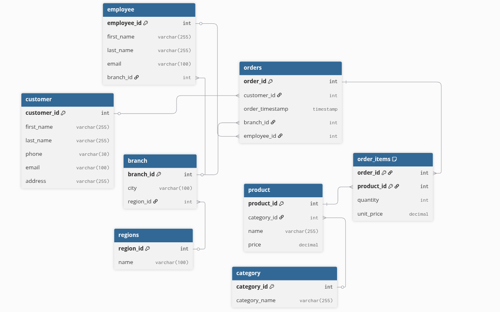

# retail-sales-dw

## description

This project simulates a fictional retail company called NovaMart — a mid-sized chain selling electronics, clothing, and home goods across multiple store branches. NovaMart's operations team has been tracking sales, inventory, and customer data in a messy spreadsheet system for years. The task is to design and build their first proper data infrastructure: a normalized transactional database that accurately captures their business operations, and then a separate analytical data warehouse that their BI team can query to answer business questions.

## Business Context & Requirements

The BI team has handed you a list of questions they need to answer regularly. Your warehouse must be able to support all of them:

- What are the total sales revenue and units sold per product category per month?
- Which store branches are performing above average compared to others in the same region?
- Who are the top 10% of customers by lifetime value, and what categories do they buy from?
- How has the average order value trended week-over-week over the last year?
- Which products have never been sold in a specific branch?
- What is the sales performance of each sales rep broken down by quarter?

# Phase 1 : OLTP 

1. The first decision after creating the `order` table was to split it into `order` and `order_items` because one order could contain many items and to achieve the 3NF.
2. You will notice that there are two columns for price: one in the `order_items` table -> `unit_price`, and another in the `product` table -> `price`, because the table needs to record the instant price the customer bought at, and the price of the product can change later.
3. `branch_id` was added to the `order` table for the performance metrics checked by the analysts and to reduce redundancy. An alternative approach was to put it in the `order_items` table, but it would be redundant as one customer can buy multiple items from the same branch, breaking the 3NF rule.
4. `category` also got its own table to remove redundancy.

## Tech stack choice to deploy phase 1

1. Docker: it's a container service that makes the application portable to be reused on any other machine.
2. PostgreSQL: will be great for OLTP because it supports ACID compliance for transactional integrity. ACID stands for:
    - Atomicity: if two customers try to buy the last item at the same time, the database will not allow it.
    - Consistency: all data follows the same rules and is consistent, like a price can't be below zero.
    - Isolation: when two operations happen at the same time, they should be separated, or rather isolated, to not affect each other.
    - Durability: what if the system shuts down? What happens to the data? It will be safe because it is saved on the hard disk.

## Synthetic data generation 
 - all the data metrics were done by reasonable assumptions under ambiguity because this not a real data set .
 - Customers: ~10,000
 - Products: ~500 -> this to randomaly makes some products statiscally be zero in some branches
 - Regions: 10 this was reasonalbe number of retail chain regions
 - Branches: 30-50 (3-5 per region) -> to answer ranking question in analysis
 - Employees: 15-20 per branch (~500-1000 total), only some appear as sales reps in orders , i assume only those are sales rep. 
 - Orders: spanning ~1 year

### syn_gen.py -> Generation Script

- You will notice first that regions and categories are fixed, which is intentional, as I chose 10 regions and 12 categories in the design.
- The `insertion` function is a universal function used to insert one or more columns. Just make sure they are comma-separated to fit the query, which led us to add the `on_conflict` parameter because some tables, such as `branch`, allow duplicates.
- If we use the `insertion` function multiple times on the same table, such as `branch`, the number of branches (e.g., 30–50) will increase each time the script is run. To prevent this, I created the `empty_check` function, which inserts data into a table only when it is empty.
- During `branch` insertion, we needed the `region_city_map` to determine which city corresponds to a specific region. This cannot be generated randomly because it would break consistency. We then map the city to its corresponding ID, which acts as the foreign key in the `branch` table, and finally format it into the branch insertion tuple using random generation.
- in `product` insertion three component need `category_id` which will come from a random choice made on the list of ids coming from `category`  table , product's name is going to be from the exention of `Faker` library which is `faker_commerce` using `Provider` to extend and give us ecommerce name then append to the list of tuples , although the loop is for 500 but result will be less because faker can generate duplicate values which will be skipped in the on conflict in the `insertion` function which produced a 363 instead of 500 because of collision 
* **customer** — Here, **10,500** records were chosen to increase the buffer in case of collisions generated by `Faker`, resulting in **10,282** unique customers.

* **employee** — For employees, a nested loop was used to ensure that each branch contains a minimum of **15** and a maximum of **20** employees. Otherwise, some branches could be left underpopulated if flat randomization were used.

* **orders** — For orders, a dictionary mapping **employee IDs** to **branch IDs** was created to maintain consistency, as it would not make sense for a customer to purchase from an employee who works at a different branch. Additionally, `date_time_between()` was used to generate timestamps spanning an entire year.

* **order_items** — `unit_price` must be retrieved from the product table because it captures the product's price at the time of purchase, even if the product price changes later.

# Phase 2 : OLAP

## Design

1. The `fact` table grain was made on product items, as the business questions track product item sales, not orders as a whole, because we can't track products and categories otherwise. The measures chosen are `quantity`, `unit_price`, and `line_total`, which is the derived revenue measure for a single fact row. I decided for it to be precomputed, as OLAP prioritizes query performance.

2. Dimensions:
    * **dim_product** — the category is folded here (denormalized).
    * **dim_branch** — the region is folded here (denormalized).
    * **dim_customer**
    * **dim_employee**
    * **dim_time** — unlike category and region ,time stayed separated from the fact timestamp, as it also will have week, month, and quarter precalculations.

3. Notes : 
    * The main reason for these changes is that OLAP is optimized for reads, unlike OLTP, which is optimized for frequent writes. This is why a denormalized version was chosen, reducing the maximum joins from 6 to 4.
   